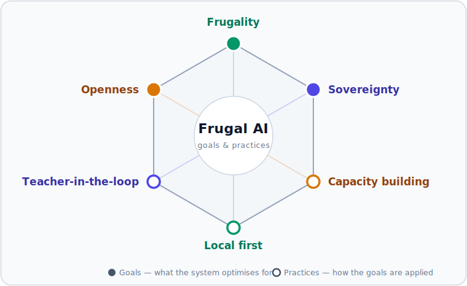

# Welcome to Frugal AI Knowledge Base

The Frugal AI knowledge base is a build reference for sovereign, local-first AI in education. It shows how to assemble AI services from open, inspectable layers that an institution can run, govern, and own — starting on a single machine and growing only as far as a task needs.

AI capability is reaching education unevenly: subscription costs, connectivity requirements, and data-governance questions put cloud services beyond many Commonwealth institutions, a gap the [Gaborone to New Delhi Compact](https://www.col.org/wp-content/uploads/2026/02/Gaborone-to-New-Delhi-Compact.pdf) and [Frugal AI: A Roadmap to Sovereign GenAI for Education](https://www.col.org/news/frugal-ai-a-roadmap-to-sovereign-genai-for-education/) commit to closing. Frugal AI reframes AI as durable institutional infrastructure rather than an externally sourced service. It continues a long Commonwealth of Learning technology tradition, from [Aptus](https://www.col.org/projects/aptus/) — open-source hardware that brings learning to communities without grid power or the internet — to [teacher-in-the-loop AI](https://jl4d.org/index.php/ejl4d/article/view/1934).


The first build is intentionally small: one local chat service on a single machine. It is a development path and does not imply pilot or production readiness.


## The Frugal AI stack

Every build in the knowledge base is a path through one layered model. The layers are substitutable and optional; the smallest useful system uses only the lower layers, and a build stays current by [swapping a component](concepts/how-the-stack-fits-together.md#how-a-component-is-swapped) as models and tools evolve.

```text
Application      chat, coding, agents, search
Gateway          sovereignty envelope: routing, compliance, guardrails
Orchestration    loop, tools, memory, retrieval        (optional)
Inference        local runtimes -> serving engines
Infrastructure   compute, OS, containers, storage
```

Read top to bottom it is the request path; read bottom to top it is the build order. See [The Frugal AI stack](concepts/how-the-stack-fits-together.md) for the full model.

## Where governance lives: the gateway and the loop

Every model request that could leave the institution passes through one governed boundary: the gateway, the sovereignty envelope. It decides what may leave, what stays local, what is logged, and what is redacted, keeping compliance, observability, and guardrails in one inspectable place rather than scattered across the system. In the first build the envelope is closed: the service runs fully local with no external traffic.

Agents add a second governed place: the loop they run in. An agent is an application that acts — it plans, calls tools, and runs commands rather than only answering — and the loop that runs it, its [harness](concepts/orchestration-layer.md#the-agent-loop), assembles its context, calls its tools, and keeps its memory. A tool or Model Context Protocol (MCP) connection can reach the network without passing the gateway, so a safe build governs three surfaces in total: model egress at the gateway, and local actions and tool egress at the loop. The [Application layer](concepts/application-layer.md) describes all three.

## Start from the task

| Task | Start with | What it gives |
| --- | --- | --- |
| Understand the model | [The Frugal AI stack](concepts/how-the-stack-fits-together.md) | The layer map, the gateway boundary, and the frugal floor. |
| Assess it for a ministry | [Gateway layer](concepts/gateway-layer.md), then the [reference architecture](reference/sovereign-education-ai-reference-architecture.md) | The governance pattern, the policy baseline, and a ministry self-assessment checklist (Appendix A of the reference architecture). |
| Assess it for an institution | [Pilot environment](components/environments/pilot.md), then the [operations overview](operations/operations-overview.md) | The questions to settle before shared use, and how to run, measure, and recover the service. |
| Match the build to the machine available | [Infrastructure layer](concepts/infrastructure-layer.md) | The closest documented path for the hardware at hand, and what is not covered yet. |
| Build the first service | [Quickstart](getting-started/quickstart.md), then [Local AI chat service](getting-started/offline-chat-service.md) | A private local chat service in about 45 minutes. |
| Add education workflows | [Math tutor](getting-started/math-tutor.md), [AI gateway](getting-started/ai-gateway.md), then [Curriculum advisor](getting-started/curriculum-advisor.md) | Exact computation, controlled cloud burst, and retrieval over approved documents. |
| Try an agent | [Coding agent](getting-started/coding-agent.md), then [Manim animator](getting-started/manim-animator.md) | A reviewed coding agent that writes and runs code through the governed stack. |
| Point an agent at the knowledge base | [Use the knowledge base with an AI agent](reference/use-with-an-ai-agent.md) | The machine-readable endpoints and the offline-clone pattern. |

## The first build: Local AI chat service

The first complete build stops at the frugal floor: infrastructure, inference, and an application, with the gateway local-only and no orchestration.

| Layer | Component |
| --- | --- |
| Application | [Open WebUI](components/applications/open-webui.md) |
| Inference | [Ollama](components/runtimes/ollama.md) with [Gemma 4 12B](components/models/gemma-4-12b.md) |
| Infrastructure | [Mac mini 24 GB](components/hardware/mac-mini-24gb.md) |

The first build proves a useful service can run locally, with prompts and chat history on the machine, components that remain inspectable, and operations documented from the start. [Example applications](concepts/example-applications.md) shows how the same floor supports a math tutor, curriculum advisor, coding agent, and future administrative workflows.

The first build is a [development](components/environments/development.md) path. Shared use is a later stage: the [pilot environment](components/environments/pilot.md) settles the governance, support, and operations decisions for a small group, and the [production environment](components/environments/production.md) sets the readiness bar for a dependable service. Pilot serving and production operations are further work in the public guides.

## Three goals, three practices

Six commitments recur across every layer, guide, and component choice, at two levels: three **goals** the approach optimises for, and three **practices** that carry them out. In the hexagon, each practice sits opposite the goal it serves. Each commitment links to the page where it is put into practice.



The goals:

- [**Frugality**](concepts/infrastructure-layer.md) — capable AI on modest, already-owned hardware, at a predictable cost.
- [**Sovereignty**](concepts/gateway-layer.md) — data, governance, and the agent loop stay under institutional control; the gateway governs what leaves as a model request.
- [**Openness**](concepts/how-the-stack-fits-together.md) — open-weight models where appropriate, and open, inspectable components throughout, so any part of the stack, including the model, can be replaced.

The practices:

- [**Local first**](getting-started/offline-chat-service.md) — the service runs on machines the institution owns and keeps working offline; external capability is reached only through controlled cloud burst. This practice delivers frugality and offline resilience.
- [**Teacher-in-the-loop**](reference/sovereign-education-ai-reference-architecture.md) — AI can draft materials, but teachers review, adapt, and approve them before they reach learners; as agents act, the same review extends to actions. This practice delivers sovereignty.
- [**Capacity building**](getting-started/coding-agent.md) — the local team gains the skills to run, recover, and extend the stack, using agents the institution governs. This practice delivers openness.

## From the Commonwealth of Learning

This knowledge base is the technical companion to COL's Frugal AI programme. Its governance and policy baseline in technical form is the [reference architecture](reference/sovereign-education-ai-reference-architecture.md) in these pages; for strategy, positioning, and the latest news, go to COL directly:

- [Frugal AI programme](https://www.col.org/frugal) — COL's overview, approach, and key resources.
- [Gaborone to New Delhi Compact](https://www.col.org/wp-content/uploads/2026/02/Gaborone-to-New-Delhi-Compact.pdf) — the teacher-led, localised-AI commitment, presented at the India AI Impact Summit 2026.
- [Frugal AI: A Roadmap to Sovereign GenAI for Education](https://www.col.org/news/frugal-ai-a-roadmap-to-sovereign-genai-for-education/).
- [COL news](https://www.col.org/news/) — ongoing Frugal AI updates.

## Scope and next work

The knowledge base grows by the discipline it documents: a new path becomes a guide only when its supporting components, safeguards, and operations pages exist. The build path remains a development path. Out of scope for the current public guides: production or shared-campus deployment, high-stakes automated decisions, and national-scale implementation. Pilot serving, production operations, and further example applications are further work, added as those foundations land.
