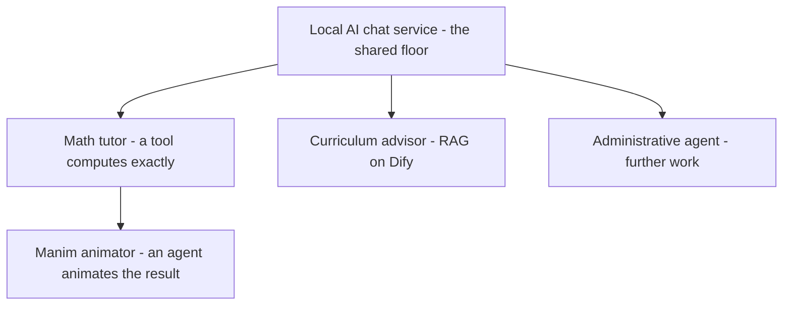

# Example applications

The layered stack is general: the same frugal floor supports many education applications, with different layers added above it. This page is a menu of worked and planned examples. Each grows from beginner to advanced as the layers are added, and new rows are filled in only when their guides exist.

## The matrix

Every example starts from the same beginner floor — the [local AI chat service](../getting-started/offline-chat-service.md) — and diverges above it.

| Application | Beginner (shared floor) | Intermediate | Advanced |
| --- | --- | --- | --- |
| Math tutor | Local chat | [Math tutor](../getting-started/math-tutor.md): a tool computes exactly | [Manim animator](../getting-started/manim-animator.md): an agent animates the result |
| Curriculum advisor | Local chat | [Curriculum advisor](../getting-started/curriculum-advisor.md): RAG over approved documents on Dify | Dify multi-step workflows at pilot scale *(further work)* |
| Administrative agent | Local chat | Tool-using actions for routine staff tasks *(further work)* | Multi-step workflows with human approval *(further work)* |

The math-tutor row is built end to end, and the curriculum advisor's intermediate cell is now built (RAG on Dify); its advanced cell and the administrative agent row remain planned. Cells stay marked *further work* until their guides exist. Where a cell names an agent — an application that acts rather than only answers — the [Application layer](application-layer.md)'s governance surfaces apply.

## What the matrix shows

Two lessons. First, the **Orchestration layer is substitutable**: the math tutor uses a simple Open WebUI tool, while the curriculum advisor uses Dify, a heavier workflow platform with built-in retrieval. Different substrates, the same layer, each chosen to fit the task. Second, **flexibility is frugal**: every example reuses the lower layers, so a new application is mostly new work at the top, not a new stack.

## Localise every example

A Frugal AI application becomes locally owned when it is adapted to its context: aligned to the national curriculum's topics and sequence, written with local names, places, and examples, and used in the local language, which the models support across many. The [math tutor](../getting-started/math-tutor.md) shows this in practice. Localisation applies to every row of the matrix.

Localisation is also where inclusion becomes verifiable: model cards state each model's language coverage, the [pilot environment](../components/environments/pilot.md) requires accessibility and language review before production, and the local-first build keeps the service available where connectivity is unreliable.

## Related pages

- [The Frugal AI stack](how-the-stack-fits-together.md)
- [Application layer](application-layer.md)
- [Math tutor](../getting-started/math-tutor.md)
