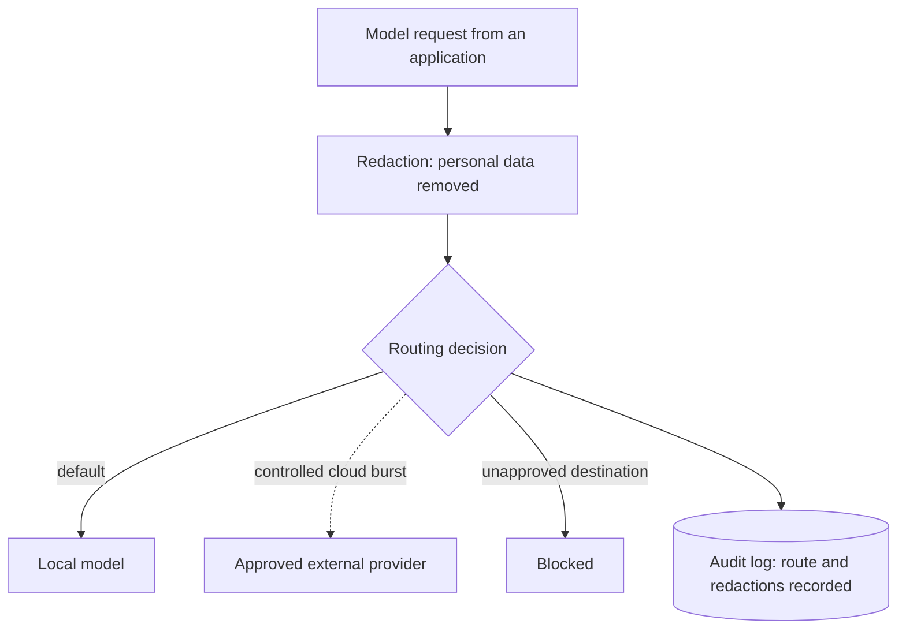
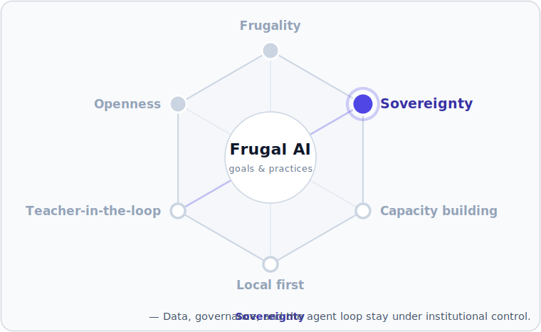

# Gateway layer

This page describes the Gateway layer of [The Frugal AI stack](how-the-stack-fits-together.md). The gateway is the boundary every model request passes through, which makes it the single place to enforce what may leave the institution and what must stay local. It is the operational form of the sovereignty envelope and the privacy airlock in the [sovereign education-AI reference architecture](../reference/sovereign-education-ai-reference-architecture.md).

## From policy to running layer

In the first chat build the gateway is only a policy: nothing leaves because nothing is configured to leave. A running gateway makes that boundary enforceable in software. Every application sends requests to one endpoint; the gateway decides where each request goes, what is removed before a model sees it, and what is recorded.

## What the gateway does

- One endpoint: applications use a single API, and the model or provider behind it can change without changing the application.
- Redaction: personal data is detected and masked before a prompt reaches a model, with the original kept only in protected logs.
- Routing: requests go to a local model by default, and to an approved external provider only when policy allows.
- Audit: requests, routes, and redactions are logged for review — the tamper-evident record the reference architecture relies on for regulatory review and individual redress, and the source of its cloud-burst frequency indicator.
- Approved destinations: only the providers configured in the gateway can be reached.

## The sovereignty envelope

The gateway is where the envelope is drawn. A fully local build keeps the envelope closed: every request stays on the machine. When a task genuinely needs a larger external model, controlled cloud burst sends only de-identified, narrowly scoped content to an approved provider, with redaction applied first and a local fallback when connectivity fails. Learner free text and identifiers are blocked by default. Cloud burst changes where a task is processed, not the oversight its output needs: output intended for learners remains Tier 1, requiring teacher approval before release, whichever route produced it. The gateway enforces the technical half of the envelope; for any approved external provider the [reference architecture](../reference/sovereign-education-ai-reference-architecture.md) also expects contractual controls — retention and deletion commitments, breach notification, audit rights, and sub-processor disclosure — which sit in the provider agreement rather than the gateway configuration.

## What the gateway does not govern

The gateway governs model egress only. An agent, an application that acts rather than only answers, also takes local actions and uses tools, and a tool or Model Context Protocol (MCP) server can reach the network without passing the gateway. Those surfaces are governed at the [application layer](application-layer.md); an assessment that includes agents should cover all three.

## What an assessment asks

The gateway configuration is where an assessment finds its answers. The questions map to the mechanisms on this page:

| Question | Where the gateway answers it |
| --- | --- |
| What can leave the institution? | Approved destinations: only the providers configured in the gateway are reachable, and anything else is blocked. |
| Where does it go? | The jurisdiction of each configured provider is a configuration choice, reviewable in one place. |
| What is removed before anything leaves? | Redaction masks personal data before a prompt reaches a model, with originals kept only in protected logs. |
| What is recorded, and who reviews it? | The audit log records requests, routes, and redactions — the tamper-evident record the [reference architecture](../reference/sovereign-education-ai-reference-architecture.md) relies on for regulatory review and individual redress, and the source of its cloud-burst frequency indicator. |
| What happens when connectivity fails? | The local model is the default and the fallback, so the service degrades to fully local rather than stopping. |
| What does the gateway not cover? | Agent loops and tool egress, governed at the [application layer](application-layer.md); an assessment that includes agents covers all three surfaces. |

The [reference architecture](../reference/sovereign-education-ai-reference-architecture.md)'s Appendix A sets these questions out in full as a ministry self-assessment checklist, alongside knowledge, infrastructure, security, and scale-readiness checks.

## When the gateway is worth running

For a single local model used by one application, the gateway is optional: governance is simple because nothing leaves. The gateway earns its place as soon as there is more than one model or application, or any external routing. That is the point where governance needs one home rather than many.

## Trade-offs and limits

- The gateway is a single point of failure by design: concentrating governance in one place means the service depends on it, so it is run and monitored like any other component — see the [operations overview](../operations/operations-overview.md).
- The envelope governs only what is routed through it. Applications are configured to reach models only via the gateway, and services are bound to localhost so nothing else can reach them; the [Local AI chat service](../getting-started/offline-chat-service.md) documents that binding.
- Redaction is pattern-based. It catches identifiers, but combinations of ordinary details — [quasi-identifiers](../reference/glossary.md) — can still identify a person, which is why learner free text is blocked from cloud burst by default rather than trusted to redaction.
- The audit log holds the un-redacted originals, so it needs a defined retention period, secure deletion on schedule, and restricted access; kept tamper-evident, it is the basis for the [reference architecture](../reference/sovereign-education-ai-reference-architecture.md)'s regulatory review and individual redress.
- Every governed hop adds a little latency and configuration; the gateway earns that cost once more than one model, application, or external route exists.

## The gateway in this knowledge base

[LiteLLM](../components/gateways/litellm.md) is the documented gateway: a self-hosted, open-source proxy that provides one OpenAI-compatible endpoint with redaction, routing, and audit logging. The layer is substitutable like every other: applications see only the endpoint, so the gateway itself can be replaced without changing them.

## Frugal practice

Run the gateway locally alongside the rest of the stack. Start with one endpoint, redaction, and logging, all local. Add an external destination only when a task needs it — and, in any deployment beyond development, only once the [Minimum Government Baseline](../reference/glossary.md) safeguards are in place — and keep the local model as the default and the fallback.

## First build: the AI gateway

The [AI gateway](../getting-started/ai-gateway.md) guide puts a local gateway in front of the chat service: a single endpoint, personal-data redaction, audit logging, and optional controlled cloud burst to one approved provider. In the through-line example, the [Manim animator](../getting-started/manim-animator.md) is the worked case of cloud burst: hard code generation goes to a stronger model through the envelope, and everything else stays local.

## Where this fits

The gateway enforces the **Sovereignty** goal for model requests that leave the institution; the agent loop and tool egress, governed at the [application layer](application-layer.md), complete it. All six commitments are introduced in [Three goals, three practices](../README.md#three-goals-three-practices).

## Related pages

- [The Frugal AI stack](how-the-stack-fits-together.md)
- [Gateway: LiteLLM](../components/gateways/litellm.md)
- [AI gateway](../getting-started/ai-gateway.md)
- [Application layer](application-layer.md)
- [Sovereign education-AI reference architecture](../reference/sovereign-education-ai-reference-architecture.md)
