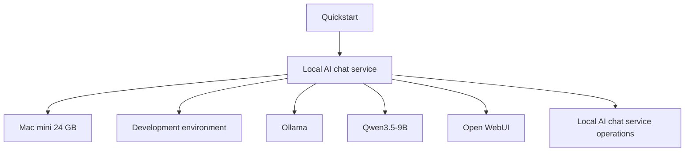

# How the stack fits together

The Frugal AI knowledge base uses a small repeatable structure:

```text
components -> stack -> guide -> operations
```

The first stack is a local AI chat service. It is intentionally narrow so the reader can build something real before exploring larger deployment patterns.

## The layers

| Layer | Page | What it answers |
| --- | --- | --- |
| Hardware | [Mac mini 24 GB](../components/hardware/mac-mini-24gb.md) | What can this machine run comfortably? |
| Environment | [Development environment](../components/environments/development.md) | What assumptions does this local setup make? |
| Runtime | [Ollama](../components/runtimes/ollama.md) | What runs the model and exposes the local API? |
| Model | [Qwen3.5-9B](../components/models/qwen-3.5-9b.md) | What model is loaded, and what are its limits? |
| Framework | [Open WebUI](../components/frameworks/open-webui.md) | What gives users a browser chat interface? |
| Operations | [Local AI chat service operations](../operations/open-webui-ops.md) | How does the service owner maintain the service after setup? |

## Why components are separate

The guide should stay focused on what to do next. Component pages answer the supporting questions:

- Why this model?
- What does the runtime do?
- What fits on this hardware?
- What are the limits?
- What can be swapped later?

This keeps the guide readable while preserving enough technical context for institutional review.

## Current path



## Future paths

Future guide paths should reuse the same pattern:

- RAG path: add document ingestion, embeddings, vector storage, and source governance.
- Agent path: add tool calling, workflow control, and stronger safety checks.
- Pilot path: add the [Pilot environment](../components/environments/pilot.md), multi-user access, backup policy, monitoring, and support ownership.
- Production path: add serving infrastructure, security review, incident response, and lifecycle management.

Do not add a component to the Frugal AI knowledge base just because it exists in `reference/`. Add it when a guide needs it.
