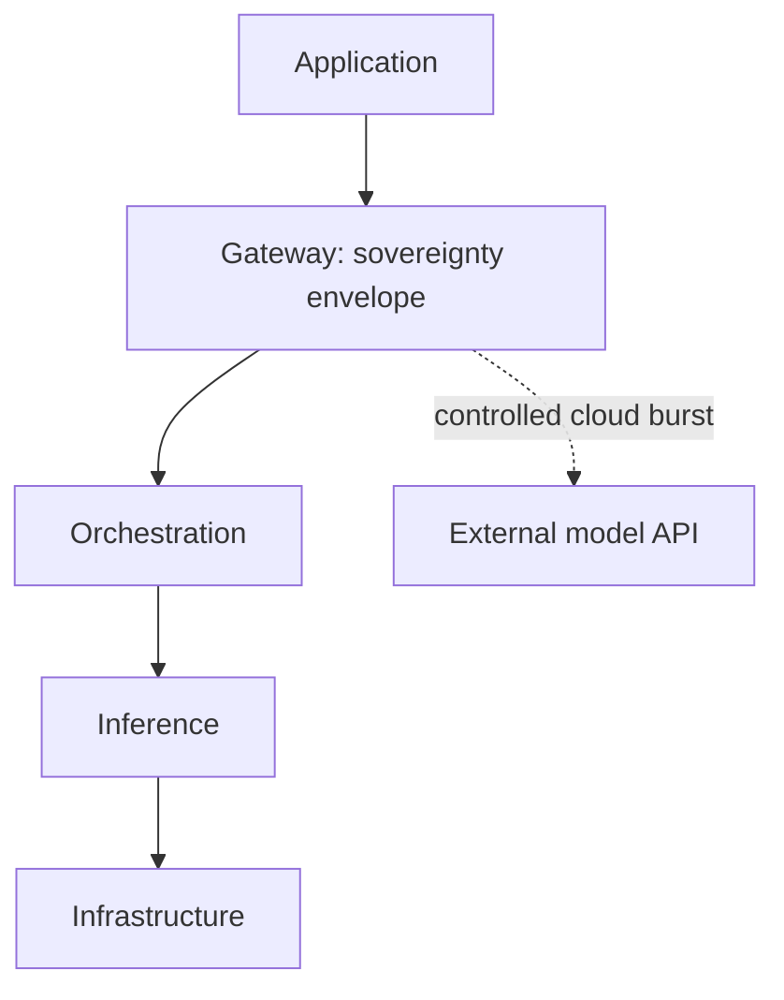

# The Frugal AI stack

A Frugal AI system is not a single product. It is a small set of layers an institution can assemble, inspect, and own, with one governed boundary wherever a request could leave local control.

The Frugal AI knowledge base treats every build as a path through this stack. The layers are substitutable: an institution can swap a runtime, change models, or add orchestration without replacing the whole system. They are also optional, which is what makes the approach frugal. The smallest useful system uses only the lower layers.

## The stack layers

The table lists the layers top to bottom, in the order a request travels; the next section explains the two ways to read that order.

| Layer | Role | Examples |
| --- | --- | --- |
| [Application](application-layer.md) | What a person actually uses; agents are a subtype. | Local chat, course search, teacher support, coding assistance, and agents. |
| [Gateway](gateway-layer.md) (sovereignty envelope) | The governed boundary every model request passes through. | Local and cloud routing, redaction, policy filters, audit logging, and guardrails. |
| [Orchestration](orchestration-layer.md) | What turns a model into a useful workflow. | The reasoning loop, tools, memory, retrieval, and context assembly. |
| [Inference](inference-layer.md) | What runs the model and serves predictions. | Local runtimes for development; serving engines for shared or higher-throughput use. |
| [Infrastructure](infrastructure-layer.md) | What everything runs on. | Compute, operating system, containers, storage, and networking. |

An agent is not a separate layer. It is an [Application](application-layer.md) that acts through the Orchestration layer's loop, under stricter human oversight; the [Application layer](application-layer.md) page covers how that loop is governed.

## Two ways to read the stack

Read top to bottom, the stack is the request path: a person's input enters at the Application layer, passes the Gateway, and reaches a model through Orchestration and Inference. The diagram below shows this reading. Read bottom to top, it is the build order, which is how the knowledge base teaches it: secure the infrastructure first, then inference, then add orchestration and applications. The sidebar's layer sections follow the build order.

## The gateway is the sovereignty envelope

The Gateway is the most important layer for education sovereignty. Because every model request passes through it, it is the natural place to enforce what may leave the institution and what must stay local.

This is the operational form of the controls described in the [sovereign education-AI reference architecture](../reference/sovereign-education-ai-reference-architecture.md): personal-data redaction, context minimisation, approved destinations, audit logging, and controlled cloud burst within a defined envelope. Governance is not spread across the system. It has one architectural home, at the boundary where a prompt could cross from local to external processing.

A fully local system still has a Gateway, in its simplest form: a local-only policy with no external egress. The [Gateway layer](gateway-layer.md) page covers how this becomes a running component that redacts, routes, and logs.

## Layers are optional: the frugal floor

A Frugal AI system degrades gracefully. The smallest useful build is Infrastructure, Inference, and an Application, with the Gateway set to local-only and no separate Orchestration layer. That is not a cut-down version of the architecture. It is the architecture at its frugal floor, suitable for a single machine or an offline school device.

Each layer is added only when a task needs it, and simplified or removed when connectivity, hardware, or capacity is limited.

## The first build: Local AI chat service

The [Local AI chat service](../getting-started/offline-chat-service.md) is the first complete path through the stack. It proves the model with the smallest honest implementation.

| Layer | This build uses | Notes |
| --- | --- | --- |
| Application | [Open WebUI](../components/applications/open-webui.md) | A browser chat interface. |
| Gateway | Local-only, no external egress | No cloud burst in this build; the envelope is closed. |
| Orchestration | None | Plain chat needs no tools, memory, or retrieval. |
| Inference | [Ollama](../components/runtimes/ollama.md) running [Qwen3.5-9B](../components/models/qwen-3.5-9b.md) | A local runtime and an open-weight model. |
| Infrastructure | [Mac mini 24 GB](../components/hardware/mac-mini-24gb.md) | A single development machine. |

This build deliberately stops at the frugal floor. It does not add orchestration or external routing, because plain local chat does not need them.

## What each layer adds as the system grows

| Layer | What it adds | Built example |
| --- | --- | --- |
| Orchestration | Tools, retrieval, and memory for assistants and agents. | The [math tutor](../getting-started/math-tutor.md) (a tool) and the [curriculum advisor](../getting-started/curriculum-advisor.md) (retrieval on Dify). |
| Gateway | A running router that enforces redaction, logging, and controlled cloud burst. | The [AI gateway](../getting-started/ai-gateway.md). |
| Inference | Serving engines for shared pilot use beyond a single machine. | The [vLLM](../components/runtimes/vllm.md) card; a pilot guide is further work. |
| Application | Coding and agent applications on the same lower layers. | The [coding agent](../getting-started/coding-agent.md) and the [Manim animator](../getting-started/manim-animator.md). |

Each is a separate path with its own guide, components, and safeguards; new paths are added only when their supporting pages exist.

## Related pages

- [Application layer](application-layer.md)
- [Local AI chat service](../getting-started/offline-chat-service.md)
- [Local AI chat service operations](../operations/open-webui-ops.md)
- [Sovereign education-AI reference architecture](../reference/sovereign-education-ai-reference-architecture.md)
