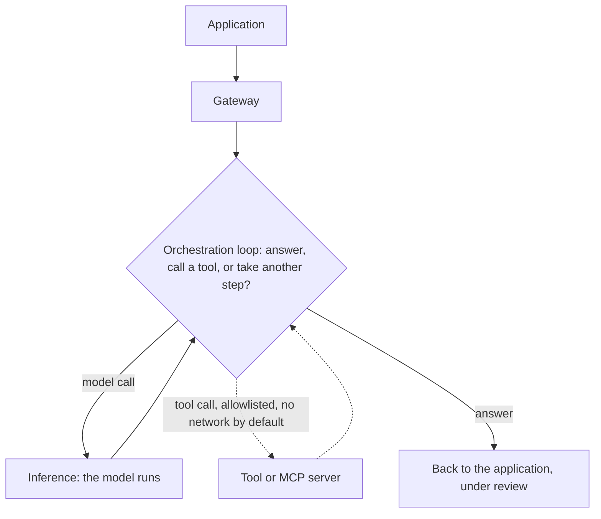

# Orchestration layer

This page describes the Orchestration layer of [The Frugal AI stack](how-the-stack-fits-together.md). Orchestration is optional: the first chat build runs without it. It is added when an application needs more than a single model reply.

## What orchestration does

The model on its own takes text in and returns text out. Orchestration is the layer that turns that into a workflow:

- a loop that lets the model take more than one step;
- tools, which are functions the model can call to act or to fetch information it does not hold — built into the application, written locally like the math tutor's, or supplied by Model Context Protocol (MCP) servers, a standard way to package tools for agents;
- memory, which carries state across turns;
- retrieval, which grounds answers in approved sources, shown by the [curriculum advisor](../getting-started/curriculum-advisor.md)'s RAG on Dify;
- context assembly, which decides what the model sees on each step. Written skills, such as the `AGENTS.md` notes in the [coding agent](../getting-started/coding-agent.md) and [Manim animator](../getting-started/manim-animator.md) guides, are context assembly in practice: reviewed procedure enters the context instead of guesswork.

## Where it sits

Orchestration sits between the Application and Inference layers. A request from an application passes the gateway, then orchestration decides whether to answer directly, call a tool, or take another step, before the model runs.

In the frugal floor this layer is absent: plain chat needs none of it. Adding orchestration is a deliberate step up in capability.

## The agent loop

When orchestration runs an [agent](application-layer.md) rather than a fixed workflow, the loop is the agent's [harness](../reference/glossary.md): it assembles context, calls tools, and keeps memory between steps. Whoever operates the harness sees what the agent sees while it works, which is why governance treats the loop as its second home and the [Application layer](application-layer.md) frames owning it as delegation capacity. In the documented builds the harness is the one built into the [coding agent](../getting-started/coding-agent.md); [Pi](https://pi.dev/) shows what owning the loop outright can look like — an MIT-licensed open-source agent toolkit whose unified model API, loop, and terminal interface an institution can inspect, extend, and run on its own machines. A standalone harness build is not a documented path yet.

## Why it matters, and what it costs

Orchestration is where capability grows and where risk grows with it. Tools let an application do useful work, but a tool can also act with side effects, and a model can call a tool at the wrong time or read its result incorrectly. Local tool calling is also less reliable than a hosted service: a small local model may describe a tool call as text instead of making it.

So orchestration is the layer where human oversight and the gateway matter most:

- side-effecting tools need permissions, audit, rollback, and human approval;
- learner-facing output needs approval before release — Tier 1 of the risk tiers in the [sovereign education-AI reference architecture](../reference/sovereign-education-ai-reference-architecture.md);
- an agent's memory accumulates institutional knowledge over time, so decide what is remembered, where it is stored, how long it is retained, and who can review it;
- the gateway still decides what may leave the institution as model calls; in a local build the envelope stays closed;
- a tool or MCP server can reach the network on its own, outside the gateway — tool egress is governed at the application layer, as described in the [Application layer](application-layer.md) governance surfaces.

## Frugal practice

Add orchestration one capability at a time. Start with read-only tools that have no side effects, keep a human in the loop, and prefer a few well-understood tools over a large toolkit; give tools no network access by default, whether local or from an MCP server. Reach for a heavier orchestration platform only when simple tools are no longer enough. The [curriculum advisor](../getting-started/curriculum-advisor.md) shows that step: RAG on [Dify](../components/orchestration/dify.md), a heavier platform, when retrieval over a document collection outgrows a single tool.

## First build: the math tutor

The [Math tutor](../getting-started/math-tutor.md) is the first orchestration build. It uses an Open WebUI tool to compute mathematics exactly, so the model explains the result instead of guessing the arithmetic, with no external egress and teacher review before any output reaches learners.

## Related pages

- [The Frugal AI stack](how-the-stack-fits-together.md)
- [Math tutor](../getting-started/math-tutor.md)
- [Sovereign education-AI reference architecture](../reference/sovereign-education-ai-reference-architecture.md)
