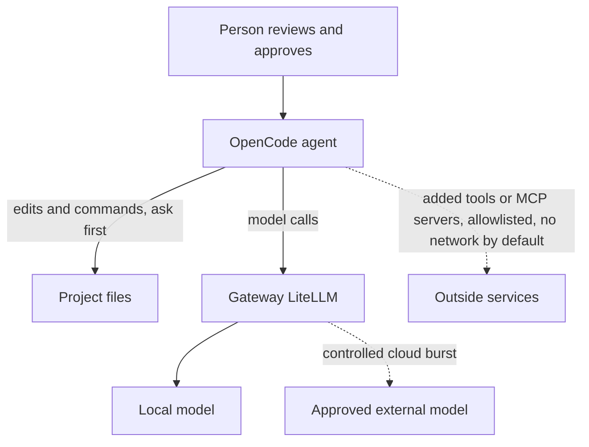
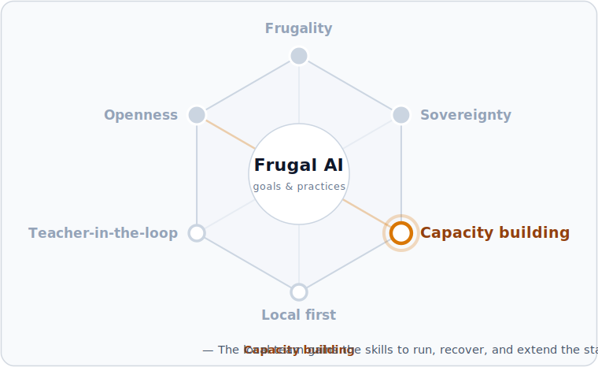

# Coding agent

This guide runs OpenCode, an open-source coding agent, on the local stack. It is the first [Application layer](../concepts/application-layer.md) agent: it reads, edits, and runs code, with its actions gated by review and its model calls routed through the [AI gateway](ai-gateway.md). It is developer and maintainer facing.


Level: advanced. Expected time: about 25 minutes once the [AI gateway](ai-gateway.md) is running. This is a development path. The agent can change files and run commands, so it runs under review and scoped permissions. It is not a learner-facing application.




## Two roles

A coding agent plays two parts in the knowledge base. It is an **example application** — the agent subtype of the [Application layer](../concepts/application-layer.md), the most autonomous and the most governed. It is also the **builder's tool**: a local team uses it to extend and maintain the rest of the stack — writing new Open WebUI tools like the [math tutor](math-tutor.md)'s, authoring gateway configurations, scaffolding components, and drafting documentation. That second role is the capacity-building payoff: the institution builds and sustains its own sovereign stack rather than depending on outside help.

## Fit and limits

- **Good for** — Developer coding tasks where an agent that reads, edits, and runs code saves time, under human review.
- **Not for** — Learner-facing use, or running with unrestricted file and command access.
- **Governance** — Three surfaces: the agent's local actions, its model calls through the gateway, and the network reach of any tools it is given.
- **Caution** — Coding quality on a small local model is limited; stronger models need more memory or controlled cloud burst.

## Prerequisites

- The [AI gateway](ai-gateway.md) is running, with a local model available through it.
- A project directory to scope the agent to.

## Component map

| Layer | This build uses |
| --- | --- |
| Application | OpenCode coding agent |
| Gateway | [LiteLLM](../components/gateways/litellm.md), governing model calls |
| Inference | A coding-capable model behind the gateway |
| Infrastructure | [Mac mini 24 GB](../components/hardware/mac-mini-24gb.md) |

## 1. Install OpenCode

Install OpenCode using the method for the platform; see the OpenCode documentation. For example, with npm:

```bash
npm i -g opencode-ai
```

Check it:

```bash
opencode --version
```

## 2. Point OpenCode at the gateway

Routing model calls through the gateway keeps redaction, approved destinations, and audit logging in one place. Create `opencode.json` in the project directory:

```json
{
  "$schema": "https://opencode.ai/config.json",
  "provider": {
    "frugal-gateway": {
      "npm": "@ai-sdk/openai-compatible",
      "name": "Frugal AI gateway",
      "options": {
        "baseURL": "http://localhost:4000/v1",
        "apiKey": "sk-local-gateway"
      },
      "models": {
        "gemma4-dev": { "name": "Gemma 4 12B via gateway" }
      }
    }
  },
  "model": "frugal-gateway/gemma4-dev",
  "permission": {
    "edit": "ask",
    "bash": "ask",
    "external_directory": "deny"
  }
}
```

The model id must match a model the gateway serves; list them with `curl http://localhost:4000/v1/models`. A local coding-capable model is the frugal default; a stronger model through controlled cloud burst can be added behind the gateway for harder tasks.

## 3. Describe the project in AGENTS.md

OpenCode reads an `AGENTS.md` file in the project directory for project instructions, so the agent works to the project's rules instead of guessing them. Create one with the facts the agent needs:

```markdown
# Project notes for the agent

- What this project is, in one line.
- Conventions to follow: naming, spelling, tests, review steps.
- Commands that are safe to run, and any that are off limits.
```

Keep it short and factual, and review it like any other file. The same convention keeps an institution's repositories agent-readable as the local team grows — part of the capacity-building role above.

## 4. Run in review-first mode

The permission block above asks for approval before any file edit or command, and denies access to files outside the project directory. Launch OpenCode in that directory:

```bash
opencode
```

Start in the built-in Plan agent, which analyses the task and proposes changes without editing; switch agents with the Tab key. Review the plan, then switch to the Build agent to apply changes. Each edit and command then waits for approval.

## Verify

| Check | Expected result |
| --- | --- |
| Model is reachable | OpenCode lists the gateway model and answers a prompt. |
| Plan is review-only | In Plan mode, the agent proposes changes without editing files. |
| Actions are gated | In Build mode, an edit or command waits for approval. |
| Egress is governed | The model calls appear in the gateway audit log. |

## Governance and review

This build shows the three governance surfaces of the [Application layer](../concepts/application-layer.md):

- Local actions: Plan mode for review, `edit` and `bash` set to ask, and `external_directory` denied to scope the agent to the project. A person approves each change.
- Model egress: routed through the gateway, so redaction, approved destinations, and audit logging apply, and cloud burst stays inside the envelope.
- Tool egress: this build adds no tools beyond the agent's built-in file and shell actions. Any tool or Model Context Protocol (MCP) server added later can reach the network without passing the gateway, so it is allowlisted and reviewed first — see the [Application layer](../concepts/application-layer.md).

## Troubleshooting

| Problem | Check | Fix |
| --- | --- | --- |
| OpenCode cannot reach the model | Provider base URL | Confirm the base URL is the gateway at `http://localhost:4000/v1` and the gateway is running. |
| The model is not listed | Model id | Match the id to a model the gateway serves; run `curl http://localhost:4000/v1/models`. |
| The agent edits without asking | Permissions | Set `edit` and `bash` to `ask`, or work in the Plan agent. |
| Coding results are weak | Model and memory | Small local models are limited; use a stronger model through controlled cloud burst behind the gateway. |

## Where this fits

The coding agent applies the **Capacity building** practice: the local team gains the skills to run, recover, and extend the stack, so open components stay locally maintainable. All six commitments are introduced in [Three goals, three practices](../README.md#three-goals-three-practices).



## Next step

Use [Local AI chat service operations](../operations/open-webui-ops.md) to run the gateway and review the audit log, and see the [Application layer](../concepts/application-layer.md) for how agents fit the stack. For a worked advanced example, see the [Manim animator](manim-animator.md).
