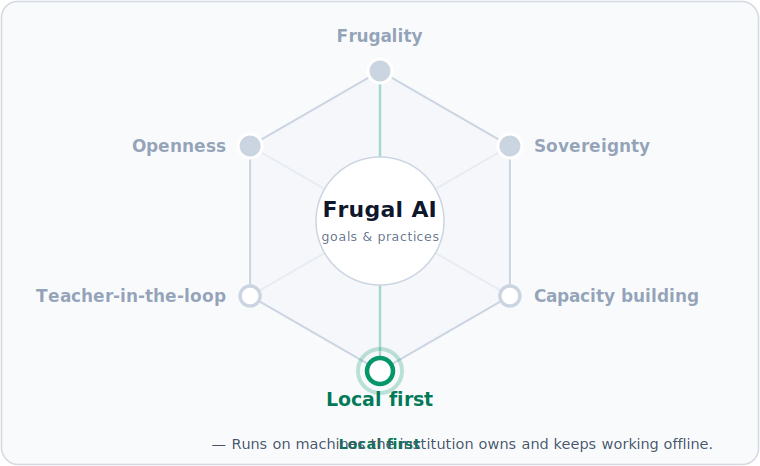

# Local AI chat service

This guide builds a private local AI chat service with Ollama, Gemma 4 12B, and Open WebUI. It is a development path for learning how the first Frugal AI stack works before pilot or production decisions are made.


Level: beginner. Expected time: about 30 minutes if Docker and Ollama are already installed.


## Component map

| Component | Page | Role |
| --- | --- | --- |
| Hardware | [Mac mini 24 GB](../components/hardware/mac-mini-24gb.md) | Defines the memory budget for the path. |
| Environment | [Development environment](../components/environments/development.md) | Sets expectations for a single-user local setup. |
| Runtime | [Ollama](../components/runtimes/ollama.md) | Runs the model and provides the local API. |
| Model | [Gemma 4 12B](../components/models/gemma-4-12b.md) | Provides the chat capability. |
| Interface | [Open WebUI](../components/applications/open-webui.md) | Provides the browser chat interface. |
| Operations | [Local AI chat service operations](../operations/open-webui-ops.md) | Keeps the service healthy after setup. |

## Prerequisites

- Docker Desktop is installed and running.
- Ollama is installed.
- 20 GB of free disk space is available.
- A terminal and browser are available on the same machine.

## 1. Start Ollama

Start the Ollama service:

```bash
ollama serve
```

On macOS, Ollama may already be running as a menu bar app. If the command says the address is already in use, leave the existing service running and continue.

Check the local API:

```bash
curl http://localhost:11434/api/tags
```

## 2. Pull the model

Pull the 12B model:

```bash
ollama pull gemma4:12b
```

Ollama currently lists `gemma4:12b` at about 7.6 GB with a 256K context window. This guide uses a smaller 8K context for a comfortable development setup on a 24 GB Mac.

## 3. Create a development model profile

Create a local model profile with a smaller context window.

Create `/tmp/Modelfile-gemma4-dev` with this content:

```text
FROM gemma4:12b
PARAMETER num_ctx 8192
```

Create the profile:

```bash
ollama create gemma4-dev -f /tmp/Modelfile-gemma4-dev
```

Test it:

```bash
ollama run gemma4-dev "Explain Frugal AI in two short sentences."
```

## 4. Start Open WebUI

This path runs Ollama on the host machine and Open WebUI in Docker. Open WebUI connects to the host Ollama API at `http://host.docker.internal:11434` and stores chat data in the `open-webui` Docker volume.

Run Open WebUI:

```bash
docker run -d -p 127.0.0.1:3000:8080 \
  --add-host=host.docker.internal:host-gateway \
  -v open-webui:/app/backend/data \
  -e OLLAMA_BASE_URL=http://host.docker.internal:11434 \
  --name open-webui \
  --restart always \
  ghcr.io/open-webui/open-webui:main
```

The `127.0.0.1` prefix binds the interface to localhost, so it is reachable only from this machine. Exposing it on a network is a pilot decision that needs authentication and TLS.

Open [http://localhost:3000](http://localhost:3000).

On first launch, create the local admin account. This account is for the local Open WebUI instance.

## 5. Select the model

In Open WebUI:

1. Open the model selector.
2. Choose `gemma4-dev`.
3. Send a short test message.

If the model has not been pulled yet, Open WebUI can pull it through the model selector or through Admin Settings > Connections > Ollama.

If the model does not appear, check that Ollama is running:

```bash
ollama ps
```

Open WebUI should show the host Ollama connection at `http://host.docker.internal:11434`.

## Verify

| Check | Expected result |
| --- | --- |
| Open WebUI loads | `http://localhost:3000` opens in the browser. |
| Model appears | `gemma4-dev` is available in the model selector. |
| Ollama connection is configured | Admin Settings > Connections > Ollama shows `http://host.docker.internal:11434`. |
| Chat works | A short prompt returns a response. |
| Multi-turn chat works | The model can answer a follow-up in the same conversation. |
| Works offline | After the model is pulled, disconnecting networking and sending a prompt still returns a response. |
| Memory remains comfortable | Expected total stack use is about 9 GB, depending on Docker and context use. |


The memory and speed values in this guide are expected development values, not a formal benchmark. Check the machine with `ollama ps` and Activity Monitor.


## Troubleshooting

| Problem | Check | Fix |
| --- | --- | --- |
| Open WebUI cannot connect to Ollama | `curl http://localhost:11434/api/tags` | Start or restart Ollama, then restart Open WebUI. |
| No model appears | `ollama list` | Confirm `gemma4-dev` exists. Re-run the model profile step if needed. |
| Responses are slow | Activity Monitor memory pressure | Close memory-heavy apps or reduce context size. |
| Port 3000 is in use | `lsof -i :3000` | Run Open WebUI on another free host port by changing the host side of the `-p` flag. |
| Container exits | `docker logs open-webui` | Check Docker Desktop is running and recreate the container if needed. |

## Stop and restart

Stop the browser interface:

```bash
docker stop open-webui
```

Start it again:

```bash
docker start open-webui
```

Restart it after a configuration change:

```bash
docker restart open-webui
```

To unload the model from memory:

```bash
ollama stop gemma4-dev
```

## Where this fits

This build is the **Local first** practice made concrete — a service on a machine the institution owns that keeps working offline — and it is what makes frugality real. All six commitments are introduced in [Three goals, three practices](../README.md#three-goals-three-practices).



## Next step

Use [Local AI chat service operations](../operations/open-webui-ops.md) for updates, backup, restore, and routine health checks.

For a single governed endpoint with personal-data redaction and audit logging, see [AI gateway](ai-gateway.md).
