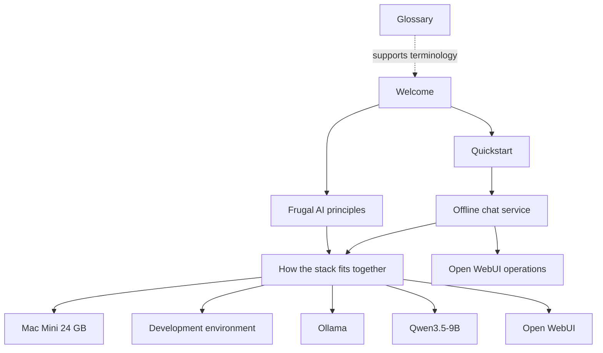

# Redesign Frugal AI GitBook Docs

## Overview

Replace the generic GitBook template content in `docs/` with a curated Frugal AI knowledge-base showcase. The first public slice should be small, coherent, and build-oriented: a reader should understand the Frugal AI thesis, follow one offline chat service path, and inspect the supporting hardware, runtime, model, framework, environment, and operations pages without being exposed to the full `reference/` working library.

The implementation should keep `reference/` intact as source material and make `docs/` the polished GitBook-facing experience.

---

## Problem Frame

The repository already contains useful Frugal AI material under `reference/`, but the GitBook-facing `docs/` tree still describes a generic SaaS platform with placeholder pages and broken links. This creates a mismatch between the project identity and the published documentation surface.

The origin requirements define the first useful outcome as a minimal offline chat service path, backed by selected component cards and a consistent editorial style. The plan must preserve that scope and avoid turning the work into a full migration of `reference/` (see origin: `internal/brainstorms/2026-06-05-frugal-ai-knowledge-base-redesign-requirements.md`).

---

## Requirements Trace

- R1. Replace generic GitBook template pages in `docs/` with a Frugal AI documentation slice centred on one runnable offline chat service path.
- R2. Include only pages required to make the offline chat guide coherent and credible; do not port all `reference/` content.
- R3. Use a GitBook structure that starts with Welcome, Quickstart, and Guide pages, then exposes supporting concepts, component cards, and operations pages.
- R4. Keep sovereign education architecture as framing, not the main builder entry point.
- R5. Derive the minimum guide path from `reference/guides/01-offline-chat-service.md`.
- R6. Include Mac Mini 24 GB, Ollama, Qwen3.5-9B, Open WebUI, development environment, and Open WebUI operations support pages.
- R7. Include compact Frugal AI principles: local control, offline capability, open-source preference, cost discipline, data sovereignty, and teacher/institutional capacity.
- R8. Keep broader pages such as Dify, agents, LM Studio, DGX Spark, large model cards, RAG, and production deployment out of the first showcase except as clearly marked future paths.
- R9. Guides follow a consistent outcome, time, prerequisites, component map, steps, verification, troubleshooting, next-step pattern.
- R10. Component cards follow a consistent what, when to use, requirements, frugal fit, compatibility, limits, links pattern.
- R11. Runbooks follow a consistent scope, start/stop, health checks, maintenance, backup/recovery, troubleshooting, escalation pattern.
- R12. Use a practical, calm, institution-friendly voice.
- R13. Prefer short paragraphs, numbered steps, verification tables, and concrete commands.
- R14. Distinguish tested values from estimates.
- R15. Use British/Commonwealth spelling consistently.
- R16. Include a dedicated editorial review pass for tone, simplified language, terminology, heading hierarchy, and jargon.
- R17. Use GitBook blocks only where they improve scanning.
- R18. Remove generic SaaS placeholder concepts, broken links, fake deployment examples, and unrelated template language.
- R19. Keep headings clear and hierarchical for GitBook Markdown, `llms.txt`, and MCP exposure.

**Origin actors:** A1 new local AI builder, A2 institutional evaluator, A3 docs maintainer, A4 AI assistant / LLM reader.

**Origin flows:** F1 build the first offline chat service, F2 evaluate Frugal AI fit, F3 extend the docs after the showcase.

**Origin acceptance examples:** AE1 compact sidebar, AE2 guide-linked supporting pages, AE3 estimated values labelled, AE4 placeholder content removed, AE5 editorial consistency pass.

---

## Scope Boundaries

- Do not port the entire `reference/` tree into `docs/`.
- Do not build RAG, Dify, multi-agent, DGX Spark, or production-serving documentation in this first showcase.
- Do not convert the knowledge base into a policy-only or academic publication.
- Do not add unverified new benchmark claims during the docs rewrite.
- Do not redesign GitBook styling beyond Markdown and GitBook content structure.
- Do not remove `reference/`; keep it as the deeper working library.

### Deferred to Follow-Up Work

- RAG, Dify, agentic workflows, pilot deployment, and production deployment docs: future guide paths once the offline chat path is complete.
- Broader model catalogue in `reference/components/models/`: future reference expansion, not part of this GitBook showcase.

---

## Context & Research

### Relevant Code and Patterns

- `docs/SUMMARY.md`: current GitBook sidebar, currently generic and should be replaced.
- `docs/README.md`: current welcome page with GitBook card and hint blocks that can inform useful block syntax, but content is unrelated.
- `docs/getting-started/quickstart.md`: current stepper syntax can be reused if it renders correctly through Git Sync.
- `docs/reference/glossary.md`: current details pattern may be reused only if glossary entries are genuinely useful.
- `reference/index.md`: strongest current framing for Frugal AI, source hierarchy, and start-here path.
- `reference/guides/01-offline-chat-service.md`: source guide for the showcase path.
- `reference/stacks/dev-ollama-qwen3.5.md`: source stack page for the local model/runtime setup.
- `reference/runbooks/dev-environment-mac-mini-24gb.md`: source for development environment setup and operational checks.
- `reference/runbooks/open-webui-ops.md`: source for day-to-day Open WebUI operations.
- `reference/components/hardware/apple-m4-mini-24gb.md`: source hardware card.
- `reference/components/runtimes/ollama.md`: source runtime card.
- `reference/components/models/qwen-3.5-9b.md`: source model card; facts need upstream verification before publishing.
- `reference/components/frameworks/open-webui.md`: source framework card.
- `reference/components/environments/development.md`: source environment card.
- `reference/reference-architectures/sovereign-education-ai.md`: source for policy/architecture framing and safeguards.

### Institutional Learnings

- No `docs/solutions/` directory is present in this repo, so there are no local institutional learning docs to incorporate.

### External References

- Commonwealth of Learning Frugal AI page: frames Frugal AI around inclusive, responsible, local, capacity-building, sovereign, and cost-disciplined AI.
- GitBook Git Sync and content-structure docs: support keeping the GitBook surface as a clear Markdown hierarchy.
- GitBook LLM-ready docs: supports concise hierarchy, Markdown accessibility, `llms.txt`, `llms-full.txt`, and MCP-friendly structure.
- Goose quickstart: useful example of a short "get running quickly" path.
- Dify docs introduction: useful example of quickstart, concepts, self-host, and tutorials as simple top-level pathways.
- NVIDIA Spark docs: useful example of local AI playbooks with time estimates and concrete first-time paths.

---

## Key Technical Decisions

- Keep `docs/` as the public GitBook surface and `reference/` as the deeper source library: this satisfies the "not porting all" requirement and keeps the sidebar usable.
- Replace template pages in place where possible: this avoids leaving stale paths and broken placeholder concepts in the published docs.
- Add `reference/editorial-style.md` as contributor guidance outside the GitBook publishing surface: this makes British spelling, simplified language, and tone review repeatable during later expansions.
- Use a guide -> stack/components -> operations relationship: this preserves the useful structure already present in `reference/` while making the public path easier to follow.
- Resolve broader references through "future paths" language rather than sidebar entries: this acknowledges Dify, agents, DGX Spark, and production deployment without expanding current scope.
- Verify upstream model/runtime facts during implementation before publishing Qwen3.5-specific claims: model names, runtime tags, and performance details are unstable enough to need current validation.

---

## Open Questions

### Resolved During Planning

- Should the plan include a tone/simplification review step? Yes. U6 is a dedicated editorial pass and `reference/editorial-style.md` gives that pass a durable checklist.
- Should British spelling be explicit? Yes. It is a requirement and a verification gate.
- Should `docs/` mirror `reference/`? No. `docs/` should be curated around the offline chat service path.

### Deferred to Implementation

- Whether `qwen3.5:9b` and current Qwen3.5-9B claims are accurate: verify against upstream model/runtime sources before writing final model and stack text.
- Which GitBook blocks render correctly from repository-authored Markdown: preserve only blocks that already exist in `docs/` or are confirmed to render in this Git Sync setup.
- Whether old placeholder pages should be deleted or replaced in place: implementation should prefer replacing in place where current sidebar paths exist, and remove only pages no longer linked from `docs/SUMMARY.md`.

---

## Output Structure

```text
docs/
  README.md
  SUMMARY.md
  getting-started/
    quickstart.md
    offline-chat-service.md
  concepts/
    frugal-ai-principles.md
    how-the-stack-fits-together.md
  components/
    hardware/mac-mini-24gb.md
    runtimes/ollama.md
    models/qwen-3.5-9b.md
    frameworks/open-webui.md
    environments/development.md
  operations/
    open-webui-ops.md
  reference/
    glossary.md
reference/
  editorial-style.md
```

This is the expected output shape. The implementing agent may adjust exact filenames if GitBook path constraints or existing links make a different shape safer, but any change should preserve the same information architecture.

---

## High-Level Technical Design

> *This illustrates the intended approach and is directional guidance for review, not implementation specification. The implementing agent should treat it as context, not code to reproduce.*



The reader path should move from outcome to supporting detail. Component cards should not compete with the guide; they should answer "why this component" and "what limits matter" when linked from the guide.

---

## Implementation Units

- [x] U1. **Replace GitBook navigation and remove template scope**

**Goal:** Establish the curated GitBook sidebar and remove the generic SaaS information architecture from the public docs path.

**Requirements:** R1, R2, R3, R8, R18, R19; F1, F2, F3; AE1, AE4.

**Dependencies:** None.

**Files:**
- Modify: `docs/SUMMARY.md`
- Modify: `docs/README.md`
- Modify or remove from navigation: `docs/core-concepts/core-concepts.md`
- Modify or remove from navigation: `docs/core-concepts/permissions.md`
- Modify or remove from navigation: `docs/core-concepts/workspaces-and-projects.md`
- Modify or remove from navigation: `docs/getting-started/getting-started.md`
- Modify or remove from navigation: `docs/getting-started/your-first-project.md`
- Modify or remove from navigation: `docs/guides/guides.md`
- Modify or remove from navigation: `docs/guides/automations.md`
- Modify or remove from navigation: `docs/guides/custom-domains.md`
- Modify or remove from navigation: `docs/reference/reference.md`
- Modify or remove from navigation: `docs/reference/configuration.md`
- Test: none -- documentation-only navigation change; verification is content and link review.

**Approach:**
- Replace `docs/SUMMARY.md` with the curated structure from the origin requirements.
- Rewrite `docs/README.md` as the public landing page for Frugal AI, with cards or concise links to Quickstart, Offline chat service, Frugal AI principles, and Components.
- Remove placeholder SaaS concepts from navigation. Files can be deleted or left unlinked depending on GitBook indexing concerns discovered during implementation.
- Account for every existing template page under `docs/core-concepts/`, `docs/getting-started/`, `docs/guides/`, and `docs/reference/` so stale placeholder content is either rewritten for the new structure or removed from the public path.
- Keep the landing page builder-first: explain the thesis briefly, then route readers to a working local path.

**Patterns to follow:**
- Use GitBook card syntax from `docs/README.md` only where it remains readable in Markdown.
- Use framing from `reference/index.md`, simplified for a first-time reader.

**Test scenarios:**
- Covers AE1. Happy path: reader opens `docs/SUMMARY.md` -> sidebar contains only the Frugal AI showcase path and supporting sections.
- Covers AE4. Edge case: search `docs/` for unrelated template terms such as "custom domain", "workspace", "deploy", and "automation" -> no linked public page uses those as product concepts.
- Integration: every page linked from `docs/SUMMARY.md` exists at the referenced path.

**Verification:**
- `docs/SUMMARY.md` matches the curated Frugal AI structure.
- `docs/README.md` gives a clear two-click route to the offline chat path.
- No broken sidebar links remain.

---

- [x] U2. **Create the start-here offline chat path**

**Goal:** Rewrite the getting-started section around a quickstart and the offline chat service guide.

**Requirements:** R1, R3, R5, R6, R9, R13, R14; F1; AE2, AE3.

**Dependencies:** U1.

**Files:**
- Modify: `docs/getting-started/quickstart.md`
- Create: `docs/getting-started/offline-chat-service.md`
- Source: `reference/guides/01-offline-chat-service.md`
- Source: `reference/stacks/dev-ollama-qwen3.5.md`
- Source: `reference/runbooks/dev-environment-mac-mini-24gb.md`
- Test: none -- documentation-only guide change; verification is procedural and link review.

**Approach:**
- Make `quickstart.md` a short orientation page: what the reader will build, what they need, expected time, and links into the guide and support pages.
- Convert `reference/guides/01-offline-chat-service.md` into `docs/getting-started/offline-chat-service.md` with the guide pattern: outcome, time, prerequisites, component map, steps, verification, troubleshooting, next step.
- Keep commands concrete, but avoid expanding into every possible platform variant.
- Include a small component map at the top of the guide linking to Mac Mini, development environment, Ollama, Qwen3.5-9B, Open WebUI, and operations pages.
- Label performance and memory values as tested or estimated according to source confidence.

**Patterns to follow:**
- Procedural structure from `reference/guides/01-offline-chat-service.md`.
- Stack setup details from `reference/stacks/dev-ollama-qwen3.5.md`.
- GitBook stepper syntax from `docs/getting-started/quickstart.md` only if it stays readable and useful.

**Test scenarios:**
- Covers AE2. Happy path: reader starts from Quickstart -> reaches Offline chat service -> follows links to every required supporting component page.
- Covers AE3. Edge case: guide mentions token speed or memory footprint -> value is labelled as tested, expected, or estimated.
- Error path: reader has no model visible in Open WebUI -> troubleshooting section points to Ollama status and connection checks.
- Integration: guide links to operations page for restart, backup, and maintenance rather than duplicating full runbook content.

**Verification:**
- A reader can identify prerequisites, complete setup, verify the service, and know where to go for operations.
- The guide does not introduce Dify, RAG, agents, DGX Spark, or production serving as part of the first path.

---

- [x] U3. **Create Frugal AI concepts and stack explanation**

**Goal:** Add concise conceptual pages that explain why the offline chat stack is Frugal AI and how the pieces fit together.

**Requirements:** R4, R7, R8, R12, R13, R19; F2, F3.

**Dependencies:** U1.

**Files:**
- Create: `docs/concepts/frugal-ai-principles.md`
- Create: `docs/concepts/how-the-stack-fits-together.md`
- Source: `reference/index.md`
- Source: `reference/reference-architectures/sovereign-education-ai.md`
- Test: none -- documentation-only concept pages; verification is editorial and link review.

**Approach:**
- `frugal-ai-principles.md` should explain local control, offline capability, open-source preference, cost discipline, data sovereignty, capacity building, and teacher/institutional oversight in plain language.
- `how-the-stack-fits-together.md` should explain the guide -> stack -> components -> operations model, using the offline chat service as the concrete example.
- Keep the sovereign education architecture as background framing and safeguards, not the main entry point.
- Add "not in this first path" language for RAG, agents, Dify, DGX Spark, and production deployment.

**Patterns to follow:**
- `reference/index.md` for the current information model.
- `reference/reference-architectures/sovereign-education-ai.md` for safeguards and education-specific framing.

**Test scenarios:**
- Happy path: institutional evaluator reads principles -> can explain why local offline chat aligns with Frugal AI.
- Edge case: reader wants production or RAG -> page says this first path does not cover it and frames it as future work.
- Integration: concepts link back to Quickstart and the stack/component pages rather than becoming a dead end.

**Verification:**
- Concept pages are short, clear, and practical.
- They support both builders and institutional evaluators without becoming policy essays.

---

- [x] U4. **Create selected component cards**

**Goal:** Add only the component cards needed to support the offline chat guide.

**Requirements:** R2, R6, R8, R10, R13, R14, R19; F1, F2, F3; AE2, AE3.

**Dependencies:** U1, U2, U3.

**Files:**
- Create: `docs/components/hardware/mac-mini-24gb.md`
- Create: `docs/components/environments/development.md`
- Create: `docs/components/runtimes/ollama.md`
- Create: `docs/components/models/qwen-3.5-9b.md`
- Create: `docs/components/frameworks/open-webui.md`
- Source: `reference/components/hardware/apple-m4-mini-24gb.md`
- Source: `reference/components/environments/development.md`
- Source: `reference/components/runtimes/ollama.md`
- Source: `reference/components/models/qwen-3.5-9b.md`
- Source: `reference/components/frameworks/open-webui.md`
- Test: none -- documentation-only component cards; verification is source traceability and link review.

**Approach:**
- Use a consistent card pattern: what it is, when to use it, what it needs, why it is frugal, compatibility, limits, and links.
- Shorten the source material. Keep what supports the offline chat path and remove deep catalogue comparisons.
- Before finalising Qwen3.5-9B and Ollama details, verify upstream model/runtime names, tags, and current claims using primary sources where possible.
- Distinguish estimated performance from measured or source-backed values.
- Avoid adding broader component cards for Dify, LM Studio, DGX Spark, or large models in this iteration.

**Patterns to follow:**
- Existing reference component cards under `reference/components/`.
- GitBook concise component pages from the researched docs: quick definition, when to use, links to next step.

**Test scenarios:**
- Covers AE2. Happy path: each guide-linked component page exists and answers its specific support question.
- Covers AE3. Edge case: performance/memory table contains estimates -> estimate labels are visible in the table or surrounding copy.
- Error path: Qwen/Ollama upstream facts cannot be verified -> page avoids precise unverified claims and cites source uncertainty.
- Integration: each component card links back to the offline chat guide or stack explanation.

**Verification:**
- Component pages are consistent in structure and tone.
- No unsupported broad catalogue pages are exposed in `docs/SUMMARY.md`.

---

- [x] U5. **Create operations and glossary support**

**Goal:** Provide the minimum operational support needed after the offline chat service is running, plus a small terminology reference.

**Requirements:** R6, R7, R11, R12, R13, R15, R18; F1, F2; AE2, AE5.

**Dependencies:** U1, U2, U4.

**Files:**
- Create: `docs/operations/open-webui-ops.md`
- Modify: `docs/reference/glossary.md`
- Source: `reference/runbooks/open-webui-ops.md`
- Source: `reference/runbooks/dev-environment-mac-mini-24gb.md`
- Test: none -- documentation-only operations content; verification is runbook structure and terminology review.

**Approach:**
- Convert `reference/runbooks/open-webui-ops.md` into a fuller public operations page with start/stop/restart, health checks, maintenance, backup/recovery, troubleshooting, and escalation notes.
- Keep operational commands focused on the offline chat stack and avoid production-grade complexity.
- Rewrite `docs/reference/glossary.md` around Frugal AI terms only: Frugal AI, local inference, runtime, model card, quantisation, context window, offline-first, data sovereignty, Open WebUI, Ollama, runbook, and stack.
- Remove unrelated generic SaaS glossary entries.

**Patterns to follow:**
- `reference/runbooks/open-webui-ops.md` for operational baseline.
- `reference/runbooks/dev-environment-mac-mini-24gb.md` for health check style.
- Existing `docs/reference/glossary.md` details blocks only if they remain readable and useful.

**Test scenarios:**
- Happy path: reader restarts Open WebUI from the operations page -> command and expected result are clear.
- Error path: Open WebUI cannot connect to Ollama -> troubleshooting points to runtime status and connection settings.
- Edge case: reader encounters a term from the guide -> glossary defines it in plain language.
- Integration: guide links to operations for maintenance instead of duplicating runbook detail.

**Verification:**
- Operations page can support day-to-day use after initial setup.
- Glossary contains only terms used by the Frugal AI docs slice.

---

- [x] U6. **Add editorial style guide and run consistency pass**

**Goal:** Make tone, simplified language, British spelling, and page-pattern consistency explicit and verify every rewritten page against it.

**Requirements:** R12, R13, R14, R15, R16, R19; A3, A4; AE3, AE5.

**Dependencies:** U1, U2, U3, U4, U5.

**Files:**
- Create: `reference/editorial-style.md`
- Modify: `docs/README.md`
- Modify: `docs/getting-started/quickstart.md`
- Modify: `docs/getting-started/offline-chat-service.md`
- Modify: `docs/concepts/frugal-ai-principles.md`
- Modify: `docs/concepts/how-the-stack-fits-together.md`
- Modify: `docs/components/hardware/mac-mini-24gb.md`
- Modify: `docs/components/environments/development.md`
- Modify: `docs/components/runtimes/ollama.md`
- Modify: `docs/components/models/qwen-3.5-9b.md`
- Modify: `docs/components/frameworks/open-webui.md`
- Modify: `docs/operations/open-webui-ops.md`
- Modify: `docs/reference/glossary.md`
- Test: none -- editorial quality gate; verification is manual and search-based.

**Approach:**
- Add `reference/editorial-style.md` as maintainer-facing guidance outside the GitBook publish tree.
- Include voice rules: practical, calm, institution-friendly, no marketing claims, no hype, no unexplained jargon.
- Include British/Commonwealth spelling rules: use "optimised", "localised", "quantisation", "artefact", and avoid mixing US spellings in new copy unless quoting a product name or source.
- Include language simplification rules: short paragraphs, direct verbs, explain acronyms once, prefer "what to do" over background theory.
- Include fact-label rules: tested, expected, estimated, source-backed.
- Run one pass across all rewritten docs for page pattern consistency and repeated terminology.

**Patterns to follow:**
- Tone from `reference/index.md`, tightened for public GitBook.
- GitBook LLM-ready docs guidance: clear hierarchy, concise content, practical examples.

**Test scenarios:**
- Covers AE5. Happy path: every rewritten page uses the same voice and a predictable page pattern.
- Covers AE3. Edge case: all estimate-like language uses an explicit tested/expected/estimated label.
- Edge case: search for American spellings such as "optimized", "localized", "quantization", "artifact" -> no new docs copy uses them outside source names or quotes.
- Integration: headings form a clean hierarchy from H1 to H2/H3 without giant prose blocks.

**Verification:**
- `reference/editorial-style.md` exists and can guide future docs additions.
- All public docs pages read as one knowledge base.
- British spelling is consistent across rewritten content.

---

- [x] U7. **Final link, source, and scope verification**

**Goal:** Verify the finished GitBook slice against the requirements and remove residual template or scope drift.

**Requirements:** R1 through R19; F1, F2, F3; AE1 through AE5.

**Dependencies:** U1, U2, U3, U4, U5, U6.

**Files:**
- Modify as needed: `docs/SUMMARY.md`
- Modify as needed: all linked public docs pages under `docs/`
- Test: none -- final documentation acceptance gate; verification is link, search, and requirements trace review.

**Approach:**
- Check every relative link from `docs/SUMMARY.md` and all rewritten pages.
- Search for broken GitBook placeholder links and generic SaaS template terms.
- Check that every page in `docs/SUMMARY.md` is part of the offline chat showcase path or a direct support page.
- Check that broader future topics are not presented as current first-path work.
- Review the final docs against the origin requirements and acceptance examples.

**Patterns to follow:**
- `internal/brainstorms/2026-06-05-frugal-ai-knowledge-base-redesign-requirements.md` as acceptance source.

**Test scenarios:**
- Covers AE1. Integration: sidebar has a compact Frugal AI path, not a full `reference/` mirror.
- Covers AE2. Integration: offline chat guide links to all required supporting docs.
- Covers AE4. Error path: stale template pages are not reachable from sidebar and do not contain broken placeholder links if retained.
- Covers AE5. Happy path: final editorial read-through confirms consistent tone, simplified language, and British spelling.

**Verification:**
- Requirements R1-R19 are satisfied or explicitly deferred.
- No linked public page contains unrelated GitBook template content.
- No first-showcase page overpromises RAG, Dify, agents, DGX Spark, production deployment, or unverified benchmarks.

---

## System-Wide Impact

- **Interaction graph:** `docs/SUMMARY.md` becomes the public navigation contract; all linked docs pages must exist and cross-link coherently.
- **Error propagation:** Broken links, stale source claims, and unsupported performance numbers are the main failure modes. The final verification unit catches them before completion.
- **State lifecycle risks:** Existing placeholder files may remain on disk if not deleted. The sidebar and internal links must ensure they are not part of the public path.
- **API surface parity:** No code APIs are affected. Published GitBook Markdown, `llms.txt`, and GitBook MCP exposure are affected by page hierarchy and headings.
- **Integration coverage:** Manual link and source verification is more relevant than automated unit tests for this documentation-only change.
- **Unchanged invariants:** `reference/` remains the deeper working library and should not be deleted or fully copied into `docs/`.

---

## Risks & Dependencies

| Risk | Mitigation |
|------|------------|
| The rewrite accidentally becomes a full reference migration | Keep `docs/SUMMARY.md` constrained to the offline chat showcase and selected support pages. |
| Model/runtime facts are stale | Verify Qwen/Ollama facts during implementation and label estimates clearly. |
| GitBook-specific blocks render poorly from Git Sync | Reuse only existing proven block patterns or fall back to plain Markdown. |
| Tone becomes too technical for institutional readers | Run U6 editorial pass against `reference/editorial-style.md`. |
| Tone becomes too policy-heavy for builders | Keep Quickstart and Offline chat service as the primary path. |
| Deleted template files break external links | Prefer replacing in place where current paths may be indexed; remove from sidebar first and only delete when safe. |
| British spelling is mixed with US spelling | Add spelling checks to U6 and final verification. |

---

## Documentation / Operational Notes

- This plan is itself a documentation change. No application runtime, database, or deployment configuration should change.
- The implementation should avoid exact shell-command test choreography in the docs plan, but final execution should still perform link checks and search-based content checks.
- If GitBook publication is available during implementation, preview the space after the rewrite to confirm navigation and block rendering.

---

## Sources & References

- **Origin document:** [internal/brainstorms/2026-06-05-frugal-ai-knowledge-base-redesign-requirements.md](../brainstorms/2026-06-05-frugal-ai-knowledge-base-redesign-requirements.md)
- Source library: `reference/index.md`
- Source guide: `reference/guides/01-offline-chat-service.md`
- Source stack: `reference/stacks/dev-ollama-qwen3.5.md`
- Source runbooks: `reference/runbooks/dev-environment-mac-mini-24gb.md`, `reference/runbooks/open-webui-ops.md`
- Source components: `reference/components/hardware/apple-m4-mini-24gb.md`, `reference/components/environments/development.md`, `reference/components/runtimes/ollama.md`, `reference/components/models/qwen-3.5-9b.md`, `reference/components/frameworks/open-webui.md`
- Architecture framing: `reference/reference-architectures/sovereign-education-ai.md`
- External docs reviewed during brainstorm: Commonwealth of Learning Frugal AI, GitBook Git Sync/content/LLM-ready docs, Goose quickstart, Dify introduction, NVIDIA Spark playbooks.
